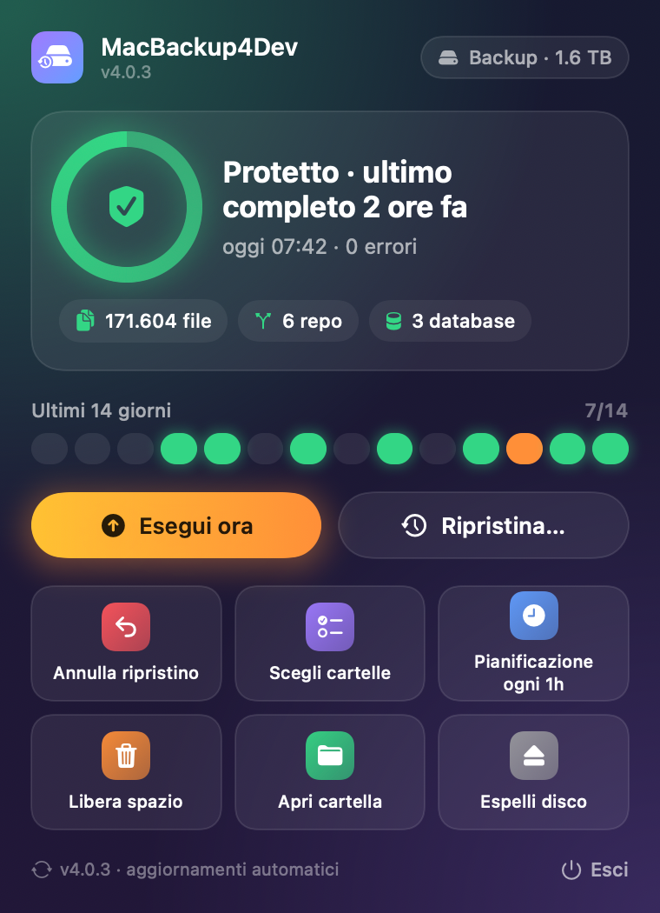
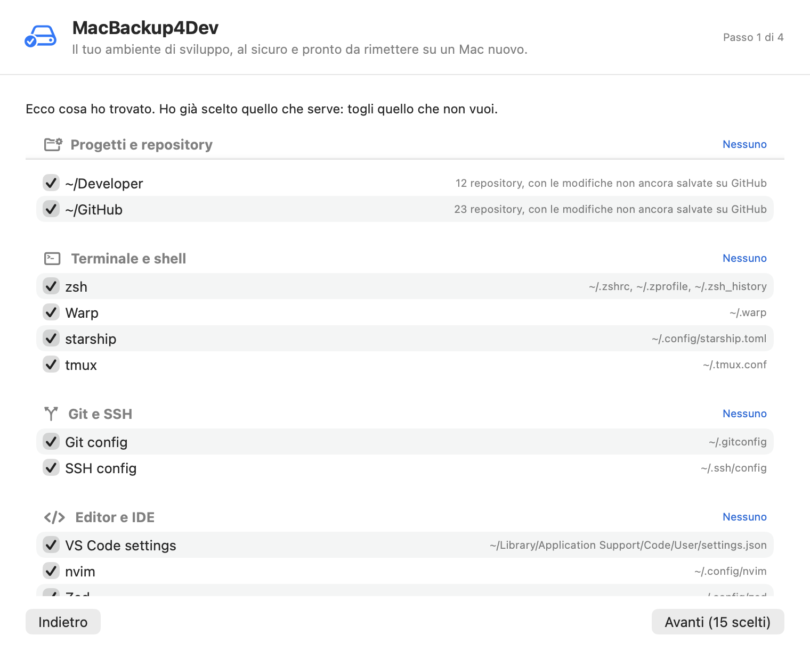

# MacBackup4Dev

> Back up a developer's Mac — projects, dotfiles, editors, AI tools, databases and the list of
> installed programs — to an external disk, and rebuild a new Mac from it, one safe phase at
> a time. Native menu-bar app, no Full Disk Access. Formerly **RustyMacBackup**.

Built for developers who live in the terminal. Not a replacement for Time Machine — a complement
to it, and an onboarding tool for the next Mac.

   [](https://github.com/Roberdan/MacBackup4Dev/releases/latest)

<p align="center">
  
  &nbsp;&nbsp;
  
</p>

<p align="center"><em>The menu-bar panel, and the first launch choosing what to back up (sample data).</em></p>

## First launch

The app finds your development environment by itself (under a second) and lets you choose:

- **Projects:** every folder with git repositories (`~/GitHub`, `~/Developer`, `~/code`, or any
  other), counted per folder; uncommitted work included. Cloud folders (OneDrive, Dropbox,
  iCloud) and links into them are never walked.
- **Terminal and shell, Git and SSH, editors and IDEs** (VS Code, Cursor, Zed, Neovim, Helix,
  Xcode, JetBrains settings without plugins), **AI assistants** (Claude Code, Copilot, Codex,
  Gemini, Cursor…), **languages and package managers**, **cloud and containers**, every tool in
  `~/.config` one by one.
- **Local Postgres databases**, dumped consistently with `pg_dump` (databases that look like
  tests are not proposed).
- **Credentials** (SSH keys, tokens, `~/.config/gh`, anything named secret/token/credential)
  are listed apart and never selected for you: the backup disk may not be encrypted.
- **Installed programs** (Homebrew formulae and apps, App Store apps, VS Code extensions,
  global npm / uv / pipx / cargo packages) are not copied: their list is saved at every backup
  so a new Mac can reinstall them.

Then choose the disk and how often (every hour, every 6 hours, nightly, or by hand) and the
first backup starts. On a new Mac with a backup disk attached, the first screen offers
**"Questo è un Mac nuovo"** instead: the guided restore below.

---

## Why

Time Machine doesn't work on MDM-managed Macs. iCloud doesn't back up `~/.ssh` or `~/GitHub`. Cloud sync services fight with `node_modules` and `.git`. Git doesn't back up your shell config.

MacBackup4Dev solves the problem that every developer has but nobody talks about: **your muscle memory lives in dotfiles, and they're never backed up.**

---

## How It Works

```
External Disk
└── MacBackup4Dev/
    ├── 2026-03-20T14:32:00/    ← snapshot (hard-linked, incremental)
    │   ├── .zshrc
    │   ├── .gitconfig
    │   ├── .ssh/config
    │   ├── .config/nvim/
    │   └── GitHub/MyProject/
    ├── 2026-03-19T08:00:00/    ← yesterday (unchanged files = zero extra space)
    └── status.json             ← live progress / last result
```

Each backup creates a timestamped snapshot. **Unchanged files are hard-linked** from the previous snapshot — so 100 snapshots of a 2 GB config tree might use only 2.1 GB total. Changed files are copied with full attribute preservation (`copyfile()` with DATA|XATTR|STAT|ACL flags).

> ⚠️ **`COPYFILE_CLONE` is intentionally disabled.** On macOS, APFS cloning silently becomes a destructive *move* when source and destination are on different filesystems (APFS → ExFAT/HFS+). We've seen this destroy entire home directories. We use `copyfile()` with `COPYFILE_ALL = 0x0F` only.

Backups run:
- **On demand** — menu bar button or `mb4d backup`
- **On schedule** — via macOS `LaunchAgent` (hourly, daily, or custom interval)
- **Automatically stopped** on disk eject or low battery

Hourly and other whole-minute intervals that divide a day use fixed calendar times
(hourly: at minute 00), not an hour after the previous backup finishes. Existing
interval schedules are migrated when the app is idle; daily times and arbitrary
custom intervals are preserved. Calendar jobs missed during sleep run on wake;
scheduled backups still require AC power and never overlap another backup.

During discovery the menu shows the number of files processed and **Totale in calcolo**,
without inventing a percentage or countdown. Once the scan finishes, copy progress
uses the known total and file throughput (including hard links); **Verifica finale**
replaces the copy estimate while Git, databases and environment information are saved.
Restore undo data (`~/.rustybackup-pre-restore`) is always excluded, including when
an older configuration still lists it as a source. Other missing, previously protected
sources continue to make a snapshot incomplete.

---

## What Gets Backed Up

The app auto-discovers installed tools on first launch. You confirm what to include via a SwiftUI tree with collapsible categories and tri-state checkboxes.

| Category | Auto-discovered paths |
|----------|-----------------------|
| **Shell** | `.zshrc`, `.bashrc`, `.bash_profile`, `.config/fish/` |
| **Git** | `.gitconfig`, `.gitignore_global`, `.gitmessage` |
| **SSH** | `.ssh/config`, `.ssh/known_hosts` *(NOT private keys — by design)* |
| **Terminal** | Ghostty, Warp, iTerm2, Alacritty, kitty, tmux, zellij |
| **Editor** | Neovim, Vim, Emacs, VS Code, Cursor, Zed, Sublime Text |
| **Dev Tools** | starship, direnv, mise/asdf, Cargo config, Brewfile |
| **AI Tools** | Claude CLI settings, Ollama config |
| **Cloud/Auth** | Tailscale, 1Password CLI config |
| **macOS** | Dock prefs, Finder prefs, keyboard shortcuts |
| **App Configs** | Every hidden folder in your home (`~/.codex`, `~/.docker`, `~/.terraform.d`, …) that holds configuration rather than data |
| **Repos** | `~/GitHub`, `~/Developer`, `~/Projects` — or any custom path |
| **Custom** | Any file or folder you add via the `+` button |

### Configuration, Not Data

Hidden folders in your home directory are picked up automatically, so a tool you install
tomorrow is backed up without editing any list. What is *not* configuration is filtered out
in two passes:

1. **By name** — package registries and downloaded runtimes (`.npm`, `.cargo/registry`,
   `.rustup`, `.nuget`), model stores (`.ollama`, `.lmstudio`), caches, logs, browser
   profiles, `node_modules`, timestamped `.bak-*` copies.
2. **By size** — a folder over 200 MB once the exclusions are applied is data, not
   configuration. The scan opens it, finds the oversized part inside, and adds *that* to the
   exclusion list while still backing up the folder itself.

Folders that hold credentials (`.ssh`, `.gnupg`, `.aws`, `.azure`, `.docker`, `.npmrc`) are
detected but left **off by default** — you opt into them explicitly, exactly as before.

### What It Will Never Touch, and why

Nothing here is lost data: each exclusion is either rebuilt better than copied, already
somewhere else, or dangerous to put back on another Mac.

| Path | Why it is not copied | How you get it back on a new Mac |
|---|---|---|
| `~/Library/Mail`, `~/Library/Messages`, `~/Library/Safari` | Reading them needs Full Disk Access (often blocked on company Macs) and they live on a server anyway | Sign in: Exchange/IMAP, iCloud Messages, Safari sync |
| `~/Library/Caches` | Rebuilt by each app | Nothing to do |
| `/System`, `/Library`, `/etc`, `/usr`, `/private` | macOS itself: copied from another Mac or macOS version they can stop it from starting | Comes with macOS |
| `/Applications`, `/opt` (Homebrew) | Programs, not your data; a copy would be old and tied to the old Mac | Their list is saved at every backup; *Nuovo Mac → Programmi* reinstalls them one by one, current versions |
| `~/Library/Containers` | Sandboxed apps' private data, protected by macOS; most of it syncs through iCloud | Signing in to the app (the only gap: apps keeping data only locally) |
| `~/Library/CloudStorage` (OneDrive, Dropbox, …) | Already in the cloud; copying it can make the sync client re-upload, and company DLP may block it | Sign in to the provider. Config-only opt-in under `[protection]` |

No Full Disk Access required. No TCC prompts. No system file access.

### Encrypted backups (4.1)

Backups are encrypted by the app, whatever the disk: snapshots live inside an encrypted APFS
disk image (`MacBackup4Dev.sparsebundle`, AES-256) on the backup disk. The image only takes
the space of its content and keeps hard links, so snapshots work exactly as on a plain disk.

- **Your password**, chosen by you (at least 10 characters: a phrase you remember is fine).
  It stays in this Mac's login Keychain, so scheduled backups open the image by themselves;
  on a new Mac you type it once. Without it the backups cannot be opened: keep it somewhere
  outside the Mac (e.g. Apple Passwords).
- **Credentials included:** with the backup encrypted, SSH keys, `gh` and other tokens are
  offered too (one checkbox each), so a new Mac is usable straight away.
- **Existing setups:** the menu shows *Backup non cifrati → Cifra*. The first encrypted backup
  is a full one; the old unencrypted snapshots stay where they are until you delete them.
- **Eject** closes the image before ejecting the disk. **Pulled out without ejecting?** The
  store is checked (and repaired if needed) when it is opened again; nothing is written into
  it until it passes. Completed snapshots are never at risk (APFS never overwrites them in place).
- **Space:** the image grows with its content; when old snapshots are deleted, the app gives
  the space back to the disk by compacting the image when nothing is running.
- The Keychain item is read through `/usr/bin/security` (trusted in its access list): the app
  is ad-hoc signed, and reading it directly would make macOS ask for the Keychain password
  after every update — and block the scheduled backup.

### A new Mac with another user name

Configuration files often contain the old home written in full (`/Users/olduser/...`:
LaunchAgents, shell files, tool configs). On restore, text files and property lists get the old
home replaced by the new one (only whole path components); binary files are copied as they are.
Snapshots record their home since 4.1; for older ones it is inferred from their LaunchAgents
and shell files.

---

## Installation

**From the pkg installer (recommended):** download `MacBackup4Dev-<version>-arm64.pkg` from
[Releases](https://github.com/Roberdan/MacBackup4Dev/releases) and open it. The build is
ad-hoc signed: if macOS says the developer cannot be verified, right-click the file → Open.
Install once: from 3.2 the app updates itself (see [Auto-Update](#auto-update)).

**From source:**

```bash
git clone https://github.com/Roberdan/MacBackup4Dev.git
cd MacBackup4Dev
./install.sh        # builds with swiftc + installs to /Applications
```

Requires macOS 14+ and Xcode (found automatically wherever it is installed, e.g.
`/Applications/Dev/Xcode.app`): the Command Line Tools alone lack the SwiftUI macro plugin.

---

## Quick Start (CLI)

```bash
# Convenience alias
alias mb4d='/Applications/MacBackup4Dev.app/Contents/MacOS/MacBackup4Dev'

# First-time setup: discovers configs, picks destination disk
mb4d init

# See what configs are detected on this Mac
mb4d discover

# Run a backup now
mb4d backup

# Check live status + last result
mb4d status

# List snapshots
mb4d list
```

## CLI Reference

| Command | Description |
|---------|-------------|
| `discover` | Show all detected dev tool configs |
| `init` | Interactive setup: discover + pick disk |
| `backup` | Run backup now; prints *Backup completo* or *Backup INCOMPLETO* with reasons |
| `stop` | Cancel a running backup |
| `status` | Live status, last result, folder list |
| `list` | List snapshots on disk |
| `snapshots` | Snapshots with their state: completo / INCOMPLETO / non verificato |
| `coverage [--days N]` | Active folders and databases that the backup does not save |
| `versions <file>` | Every distinct version of one file across snapshots |
| `find <text> [--snapshot S]` | Search files in a snapshot |
| `topics` | Restorable topics (Warp, Terminale e shell, Claude Code, …) |
| `restore-topic <name> [--snapshot S] [--yes]` | Restore a topic (preview without `--yes`) |
| `restore-file <file> [--snapshot S] [--to <dir>] [--yes]` | Restore one file or folder (preview without `--yes`) |
| `undo [dir] [--file <file>]` | Undo the last restore, or one file of it |
| `new-mac` | New Mac: checks, then the phases in order with what is done |
| `new-mac --stage <id>[,id] [--yes]` | Run one phase (preview without `--yes`) |
| `new-mac --stage programmi --packages brew:jq,cask:warp --yes` | Reinstall chosen programs (`--all-packages`: all missing ones) |
| `scan` | What the first-launch setup finds on this Mac |
| `new-mac --stage servizi --agents <label> --yes` | Turn on one service, watched; moved aside if it fails |
| `new-mac --undo <id>` / `--undo servizio:<label>` | Undo a phase / turn a service off |
| `prune [--dry-run \| --yes]` | Preview retention-policy cleanup; `--yes` deletes |
| `prune --older-than 1m\|6m\|1y [--dry-run \| --yes]` | Preview/delete snapshots older than 1 month, 6 months or 1 year |
| `restore <snapshot> [path] --to <dest>` | Legacy whole-path restore |
| `config show\|add\|remove\|edit` | Manage backed-up paths |
| `schedule on\|off\|interval <min>\|daily <hour>` | Manage LaunchAgent schedule |
| `errors [--all]` | Show categorised backup errors |
| `measure-menu` | Debug: open the real popover and check it fits its content |
| `render-menu <dir>` | Debug: draw the popover content in its main states to PNG |
| `render-onboarding <dir>` / `render-restore <backup> <dir>` | Debug: save the first-launch and Nuovo Mac windows as PNG |
| `--version` | Print version |

---

## Configuration, Not Data

Hidden folders in your home directory are picked up automatically, so a tool you install
tomorrow is backed up without editing any list. What is *not* configuration is filtered out
in two passes:

1. **By name** — package registries and downloaded runtimes (`.npm`, `.cargo/registry`,
   `.rustup`, `.nuget`), model stores (`.ollama`, `.lmstudio`), caches, logs, browser
   profiles, `node_modules`, timestamped `.bak-*` copies.
2. **By size** — a folder over 200 MB once the exclusions are applied is data, not
   configuration. The scan opens it, finds the oversized part inside, and adds *that* to the
   exclusion list while still backing up the folder itself.

Folders that hold credentials (`.ssh`, `.gnupg`, `.aws`, `.azure`, `.docker`, `.npmrc`) are
detected but left **off by default** — you opt into them explicitly, exactly as before.

### What It Will Never Touch

These paths are hardcoded as forbidden and enforced at both the UI and engine level —
including the "Aggiungi percorso" picker, which now rejects them on add instead of
listing them as if they were backupable:

```
~/Library/Mail         ~/Library/Messages      ~/Library/Safari
~/Library/Containers   ~/Library/Caches
/Library   /System   /etc   /Applications   /usr   /opt   /private
```

`~/Library/CloudStorage` (OneDrive, Dropbox, Google Drive, …) is forbidden by the same
rule but for a different reason: not a daemon-crash risk, a *provider* one (a sync client
re-uploading a local copy, a company's DLP policy blocking the copy). See `[protection]`
below for the config-only opt-in.

No Full Disk Access required. No TCC prompts. No system file access.

---

## Installation

**From the pkg installer (recommended):** download `MacBackup4Dev-<version>-arm64.pkg` from
[Releases](https://github.com/Roberdan/MacBackup4Dev/releases) and open it. The build is
ad-hoc signed: if macOS says the developer cannot be verified, right-click the file → Open.
Install once: from 3.2 the app updates itself (see [Auto-Update](#auto-update)).

**From source:**

```bash
git clone https://github.com/Roberdan/MacBackup4Dev.git
cd MacBackup4Dev
./install.sh        # builds with swiftc + installs to /Applications
```

Requires macOS 14+ and Xcode (found automatically wherever it is installed, e.g.
`/Applications/Dev/Xcode.app`): the Command Line Tools alone lack the SwiftUI macro plugin.

---

## Quick Start (CLI)

```bash
# Convenience alias
alias mb4d='/Applications/MacBackup4Dev.app/Contents/MacOS/MacBackup4Dev'

# First-time setup: discovers configs, picks destination disk
mb4d init

# See what configs are detected on this Mac
mb4d discover

# Run a backup now
mb4d backup

# Check live status + last result
mb4d status

# List snapshots
mb4d list
```

## CLI Reference

| Command | Description |
|---------|-------------|
| `discover` | Show all detected dev tool configs |
| `init` | Interactive setup: discover + pick disk |
| `backup` | Run backup now (foreground, with progress) |
| `stop` | Cancel a running backup |
| `status` | Live status, last result, folder list |
| `list` | List snapshots on disk |
| `prune [--dry-run \| --yes]` | Preview retention-policy cleanup; `--yes` deletes |
| `prune --older-than 1m\|6m\|1y [--dry-run \| --yes]` | Preview/delete snapshots older than 1 month, 6 months or 1 year |
| `restore <snapshot> [path] --to <dest>` | Restore files from a snapshot |
| `config show\|add\|remove\|edit` | Manage backed-up paths |
| `schedule on\|off\|interval <min>\|daily <hour>` | Manage LaunchAgent schedule |
| `errors [--all]` | Show categorised backup errors |
| `--version` | Print version |

---

## Configuration

### Freeing backup disk space

In the menu-bar app, choose **Libera spazio…**, then **1 mese**, **6 mesi**
or **1 anno**. The preview shows the destination, current free space, cutoff date and number
of snapshots. After deletion it reports the space actually freed, measured on the disk.
Nothing is deleted until you confirm **Elimina backup**; **Annulla** keeps everything.
This is a one-time cleanup, not a change to your scheduled retention policy.
The most recent snapshot is always kept, even if it is older than the selected period.

The same operation is available from the CLI:

```bash
mb4d prune --older-than 6m           # preview only
mb4d prune --older-than 6m --yes     # permanently delete after reviewing
```

Age refers to the snapshot date, not the modification dates of files inside it.
Periods use calendar months; snapshots exactly on the cutoff are retained.
Cleanup only removes complete, timestamp-named snapshot directories in the configured
destination, never source files, in-progress backups, symbolic links or unrelated folders.
Backup, restore and cleanup share a destination lock to prevent concurrent deletion.
Failures are reported rather than counted as successful removals. If a removal is interrupted,
its remaining files stay in a hidden `.deleting-*` directory, not a restorable snapshot;
the error includes that path for recovery. This operation does not empty those remnants.

**Space freed is not the sum of snapshot sizes:** unchanged files are hard-linked.
Their space is recovered only after the last snapshot referencing them is removed.
Cache data already in retained snapshots is left intact; exclusions apply to future backups.

### Cache and temporary-file exclusions

Known regenerable caches and temporary files are **always excluded**, including for old
configurations with an empty `[exclude]` list and explicitly selected source files/folders.
These include `node_modules`, `.next`, `.nuxt`, `.svelte-kit`, `.cache`, `.parcel-cache`,
`.turbo`, `.npm`, `.pnpm-store`, `.yarn/cache`, `.yarn/unplugged`, Python bytecode and
test/type-checker caches, `.venv`, `.tox`, `.nox`, Swift `.build`/`DerivedData`,
Rust `target/debug` and `target/release`, Android `build/intermediates`, Gradle runtime
caches, macOS cache folders, `tmp`, `temp`, `*.tmp`, `*.temp`, editor swap/backup files.
Multi-component exclusions work inside nested repositories too.

Your configured exclusions are added to this mandatory set. The mandatory rules do not
exclude source files merely because their names contain "cache" or "temp", nor do they
exclude `.env`, dependency lockfiles, databases, `.jsonl`, or Git history by themselves.
Existing configured/default exclusions still apply (including broader data/Git exclusions).
Generic folders named `tmp` or `temp` are *not* excluded automatically, because outside
repositories they can hold real work; add them to `[exclude]` if they are disposable.
Custom cache locations need an explicit pattern: the app cannot infer every tool's temporary
files, and deliberately does not apply all `.gitignore` rules, which may hide valuable local data.

### Configuration file

Config lives at `~/.config/macbackup4dev/config.toml` and is created by the first-launch setup (or `MacBackup4Dev init`). You can also edit it directly.

```toml
[source]
paths = [
    "~/.zshrc",
    "~/.gitconfig",
    "~/.ssh/config",          # known_hosts only — private keys excluded
    "~/.config/ghostty",
    "~/.config/nvim",
    "~/.config/starship.toml",
    "~/GitHub",               # entire GitHub folder, incremental
]

[destination]
path = "/Volumes/BackupDisk/MacBackup4Dev"

[exclude]
patterns = [
    "node_modules", ".git/objects", "*.tmp",
    ".DS_Store", "Caches", "Cache", "__pycache__",
]

[retention]
hourly  = 24    # keep last 24 hourly snapshots
daily   = 30    # keep last 30 daily snapshots
weekly  = 52    # keep last 52 weekly snapshots
monthly = 0     # keep forever

[protection]
include_rights_managed_files = false
include_cloud_storage = false
```

### CloudStorage opt-in (OneDrive, Dropbox, Google Drive, …)

`~/Library/CloudStorage` is excluded by default (see above). Setting
`[protection] include_cloud_storage = true` in `config.toml` lifts the exclusion for
that one path — it does **not** weaken any of the other forbidden paths. There is
**no UI checkbox for this on purpose**: unlike Rights Management (worst case, a file is
skipped), touching a cloud-provider folder from a backup tool is one accidental click
away from that provider's sync client behaving unpredictably. Edit the config file
directly if you need it.

### Rights Management protection (managed documents)

Recognized Rights Management protected files are **excluded by default**, regardless of
destination. This is not an Office-format exclusion: ordinary Office files, PDFs, images
and text remain included. A sensitivity label alone is not proof of encryption/protection.

- **Separate opt-in.** In the backup source selector, enable **Includi file protetti
  (Rights Management)**.
  **Tutti** / **Nessuno** and folder selections never change this switch. **Avvia Backup**
  saves it for subsequent manual, CLI and scheduled runs; **Annulla** discards the edit.
  Alternatively, set `[protection] include_rights_managed_files = true`. This permits normal copy attempts,
  not a bypass of company protections: authorization dialogs or blocked copies can return.
- **Exclusion before any copy or hard link.** Explicitly selected protected files are excluded
  too. New snapshots omit them even if an older snapshot contains them. Existing snapshots
  are not modified by this preference (normal retention still applies).
- **A skip is never silent.** Skipped files are counted in `status.json` (`files_skipped`) and
  reported in `errors.json` under `rights_managed_skipped` (up to 50 example paths).
  Malformed inspection metadata is skipped separately under
  `protection_inspection_failed`, with the reason in the log, not claimed as rights protection.
  Ordinary permission, missing-file and I/O errors retain their normal actionable categories.

Detection runs locally, without launching a document viewer, authenticating, decrypting,
changing labels or uploading data:

- Microsoft protected containers: `.pfile`, `.ppdf`, `.ptxt`, `.pxml`, protected image
  extensions and `.rpmsg` (case-insensitive).
- Compound-file directory metadata: `DRMEncryptedTransform` / `DRMEncryptedDataSpace`
  from [MS-OFFCRYPTO IRMDS](https://learn.microsoft.com/en-us/openspecs/office_file_formats/ms-offcrypto/dc6708bb-e852-44b1-acba-f74614155191).
  The directory allocation chain is followed even when fragmented; password-only Office
  encryption is not treated as Rights Management.
- PDF `MicrosoftIRMServices` security-handler names and the legacy
  `MicrosoftIRMServices Protected PDF.pdf` attachment name. PDFs are scanned in bounded-memory
  chunks, including metadata in the middle; larger PDFs require an additional read pass.

**Limits:** this is a format-marker detector, not the Microsoft MIP SDK or an exhaustive
rights-policy evaluator. Unknown/vendor-specific protection, renamed generic containers,
compressed PDF metadata and protected attachments inside arbitrary archives can be missed.
Detected markers indicate protection, not license validity. Files changing during a backup
can also invalidate inspection. See Microsoft's
[supported formats](https://learn.microsoft.com/en-us/information-protection/develop/concept-supported-filetypes).

**Endpoint DLP is different:** a company may block copies of *unprotected, unlabeled*
documents. Such a policy is not stored as Rights Management protection in the file; this
filter cannot predict it or guarantee that every company dialog disappears. Full Disk Access
does not override it. The previous `skip_unlabeled_office` / `skip_when_label_unknown` flags
are retired; older configs adopt the new protection-only default when the new key is absent.

**It is easy to blame the wrong folder here.** `~/Library/CloudStorage` (OneDrive included)
is always excluded (see "What It Will Never Touch" above), so it is never the source of an
endpoint-DLP prompt during a backup. The real, repeatable source: an **ordinary Git repo
that is a configured backup source and happens to contain unlabeled company Office files**
(e.g. a `.pptx`/`.xlsx`/`.docx` committed into a corporate repo's docs/archive folder). The
backup engine genuinely reads/copies those — that is a real "copying an unlabeled office
file" event, not a false positive. Confirmed 2026-09-27: `~/GitHub/FDE_Update/zzArchive/`
had four such files. Fix at the source, not in this tool: apply a sensitivity label to the
file (even the unencrypted default label clears it), or add an `exclude.patterns` entry for
that specific file/folder if it doesn't need to be in the backup at all.

---

## Safety net (3.0)

- **Verified snapshots**: `_rustymacbackup/manifest.json` in every snapshot says whether it is
  complete. Incomplete ones are never the restore default and never count as "protected".
- **Unpublished commits**: a `git bundle` per repository with only the commits not on a remote.
- **Databases**: list them in config; they are copied consistently.

```toml
[databases]
sqlite = ["~/GitHub/MyApp/runtime/history.db"]
postgres = ["my_app_db"]

[coverage]
ignore = ["~/Scratch"]          # never report this folder as "not backed up"

[topics]
"My project" = ["~/GitHub/my-project", "~/.config/my-project"]
```

- **Coverage audit**: active folders and databases outside the backup are shown in the menu.
- **Retention**: the 3 newest complete snapshots are never deleted; nothing is pruned while the
  Mac looks new or emptied.

## Menu Bar App

Launch the app (no arguments) to get the menu-bar popover: a dark panel lit by the state
colour, sized to its content.

```
┌──────────────────────────────────────────────┐
│ [▣] MacBackup4Dev        ( RoberdanBCK 1,4TB)│
│ ┌──────────────────────────────────────────┐ │
│ │  ╭──╮   Protetto · ultimo completo        │ │  ring: green shield when protected,
│ │  │✓ │   2 ore fa                          │ │  live % while a backup runs,
│ │  ╰──╯   oggi 07:42 · 0 errori             │ │  orange / red when it needs you
│ │  (171.604 file) (6 repo) (3 database)    │ │
│ └──────────────────────────────────────────┘ │
│ [!] Cartella non salvata  Ignora [Aggiungi]  │  ← coverage audit, one card per problem
│ Ultimi 14 giorni                       7/14  │
│ ● ● ● ● ● ● ● ● ● ● ● ● ● ●                  │
│ [   Esegui ora   ]   [   Ripristina…   ]     │
│ ┌─────────┐ ┌─────────┐ ┌─────────┐          │
│ │ Annulla │ │ Scegli  │ │ Pianif. │          │  tiles with coloured icons
│ │ripristin│ │cartelle │ │ ogni 1h │          │
│ ├─────────┤ ├─────────┤ ├─────────┤          │
│ │ Libera  │ │  Apri   │ │ Espelli │          │
│ │ spazio  │ │cartella │ │  disco  │          │
│ └─────────┘ └─────────┘ └─────────┘          │
│ Solo gli snapshot completi contano     Esci  │
└──────────────────────────────────────────────┘
```

- **Esegui ora** backs up what is configured, immediately.
- **Scegli cartelle** opens the folder picker. Every configured folder is listed (also the ones
  added by hand or from the coverage audit, under *Le tue cartelle*); **Tutti** never selects
  items that hold credentials (SSH keys, tokens): those are chosen one by one.
- **Ripristina…** opens the restore window: *Argomento*, *File* (every version), *Nuovo Mac*.
- **Espelli disco** refuses while a backup runs (also a scheduled one), says which apps keep
  the disk busy, and forces the unmount only when only Spotlight's indexers are left.
- Problems appear with the button that fixes them: *Riprova* for an incomplete backup,
  *Aggiungi* / *Ignora* for a folder or database that is not backed up. The audit never
  suggests credentials, parked folders (`_name`), caches, a tool's own databases or git
  worktrees.
- Notifications say *Backup completo* or *Backup incompleto* with the reason, also for
  scheduled runs. Starting a backup while one is running shows the running one.

**Libera spazio…** opens a small menu (older than 1 month / 6 months / 1 year), shows a preview
and deletes only after explicit confirmation; the 3 newest complete snapshots are never
deleted. See [Freeing backup disk space](#freeing-backup-disk-space).

---

## Architecture

Single-binary `.app` bundle — no frameworks, no SPM, no Xcode project. Compiled with raw `swiftc`.

```
Sources/
├── App/
│   ├── AppDelegate.swift       # Menu bar, popover lifecycle, backup/restore/eject actions
│   ├── StatusManager.swift     # Polls status.json, manages AppState
│   ├── AutoUpdater.swift       # Scheduled check, verify, rename swap, relaunch
│   ├── UpdateSignature.swift   # Ed25519 verification of update archives
│   ├── IconManager.swift       # Animated menu-bar icon
│   └── main.swift              # Entry point: CLI dispatch or NSApplication.main()
├── Backup/
│   ├── BackupEngine.swift      # Core loop: QueueGate (never drops), workers, manifest, finalisation
│   ├── BackupEngine+Helpers.swift  # Mount validation, lock, per-file copy
│   ├── SnapshotManifest.swift  # Per-snapshot manifest + SnapshotCatalog (which snapshot is good)
│   ├── GitSafety.swift         # git bundle of unpublished commits per repository
│   ├── DatabaseDumps.swift     # SQLite online backup + pg_dump
│   ├── CoverageAuditor.swift   # Active folders/databases not backed up (no noise)
│   ├── SelectiveRestore.swift  # Topics, file versions, preview, atomic apply, per-file undo
│   ├── NewMacRestore.swift     # Checklist, repos, databases, Homebrew, LaunchAgents
│   ├── NewMacStages.swift      # "Nuovo Mac" a tappe: phases, progress, undo, shell/service checks
│   ├── ProtectionSummary.swift # "Protetto · ultimo completo …" for the menu
│   ├── RetentionManager.swift  # Pruning; protects the 3 newest complete snapshots
│   ├── SnapshotCleanup.swift   # Manual cleanup: preview, confirm, measure freed space
│   ├── FileScanner.swift       # Traversal; realpath-based relative paths
│   ├── HardLinker.swift        # Hard-link decision and copyfile (never COPYFILE_CLONE)
│   ├── RestoreEngine.swift     # Legacy whole-path restore + undo
│   ├── DestinationLock.swift   # Backup, restore and cleanup never overlap
│   └── Shell.swift             # Process runner with timeout and non-blocking drain
├── UI/
│   ├── PopoverView.swift       # SwiftUI popover (3.1 look)
│   ├── PopoverViewController.swift # NSHostingController: the popover follows the content size
│   ├── RestoreCenter.swift     # Ripristina window: Argomento / File / Nuovo Mac
│   ├── TreeView.swift          # Folder picker with tri-state checkboxes
│   └── AppUIState.swift        # Observable state shared between AppDelegate + SwiftUI
├── Config/
│   ├── ConfigManager.swift     # TOML config ([source], [databases], [coverage], [topics], …)
│   ├── ConfigDiscovery.swift   # Auto-discovery of dev tool paths
│   └── ScheduleManager.swift   # LaunchAgent bootstrap/bootout
├── CLI/
│   ├── CLIHandler.swift        # Subcommands
│   ├── CLIRestore.swift        # 3.0 restore/coverage commands
│   ├── CLIRender.swift         # render-menu (debug)
│   └── CLIMeasure.swift        # measure-menu (debug)
└── Diagnostics/
    └── ErrorReporter.swift     # Error taxonomy, localised titles, suggested actions
```

**Key design decisions:**

- **No Full Disk Access** — whitelist model, kept honest by the coverage audit
- **A snapshot is good only if its manifest says so** — never "the newest folder"
- **Hard links for deduplication** — same as Time Machine, but transparent
- **`copyfile()` not `COPYFILE_CLONE`** — APFS cloning is dangerous cross-volume (see above)
- **Lock file with PID + timestamp + UUID** — stale lock detection survives crashes
- **`mountedVolumeURLs()` not `statfs()`** — `statfs()` returns success on ejected volumes
- **No SPM / no Xcode project** — single `swiftc` invocation, easy to audit

---

## Building & Testing

```bash
./build.sh                      # build (finds Xcode automatically)
./run-tests.sh                  # 157 tests, including real engine runs in a sandbox
./build-pkg.sh                  # distributable .pkg + .app.zip
VERSION=4.0.0 ./build-pkg.sh    # specific version
build/MacBackup4Dev.app/Contents/MacOS/MacBackup4Dev measure-menu   # real popover fits?
```

Tests cover the engine end to end in a sandbox (no file dropped, incomplete snapshots, git
bundles applied to a fresh clone, SQLite/WAL copies, coverage noise), retention protection,
selective restore and per-file undo, a whole *Nuovo Mac* rebuild, the folder picker, config
round-trips and the pre-3.0 suites. Releases: push a `v*` tag; the workflow runs the tests
and publishes the `.pkg` and `.app.zip`.

---

## Restore & Undo

Three ways, in the menu (**Ripristina…**) and in the CLI. Each one previews first and can be
undone file by file (`undo`, or *Annulla l'ultimo ripristino* in the menu).

```bash
MacBackup4Dev snapshots                    # completo / incompleto / non verificato
MacBackup4Dev topics                       # Warp, Terminale e shell, Claude Code, …
MacBackup4Dev restore-topic warp           # preview; add --yes to restore
MacBackup4Dev versions ~/.zshrc            # every distinct version of one file
MacBackup4Dev restore-file ~/.zshrc --snapshot 2026-10-04_190948 --yes
MacBackup4Dev new-mac                      # checklist + preview of a whole new Mac
MacBackup4Dev new-mac --steps config,repos,databases --yes
```

**Nuovo Mac** restores configuration files that are missing (never overwriting), clones each
repository on the branch and commit it had, puts unpublished commits back from the saved
bundle and the uncommitted files on top (so `git status` shows exactly what was local),
restores SQLite files and recreates absent Postgres databases. A half-restored folder in the
way is moved to `~/MacBackup4Dev-copie-parziali`, never deleted.

Only complete snapshots are offered by default. Restoring from an incomplete one requires
naming it with `--snapshot` and prints a warning.

## Auto-Update

The app updates itself, Sparkle-style, with no admin password and nothing to click.

- **When:** 30 s after launch, then at most every 6 hours (an hourly tick that asks GitHub only
  when due). Drafts and pre-releases are ignored.
- **Only genuine updates:** every `.app.zip` and `.pkg` on GitHub ships with a `.sig`, the
  Ed25519 signature made by the release workflow with a key that exists only as a GitHub
  Actions secret (`UPDATE_SIGNING_KEY`, with a backup in the maintainer's Keychain). The app
  embeds the public key (`UpdateSignature.swift`) and installs nothing unsigned or signed by
  another key. On top: `codesign --verify`, same bundle identifier, version equal to the
  release's and newer than the running one (no downgrades). `SHA256SUMS.txt` lists the hashes.
- **Never in the middle of work:** an update waits while a backup (also a scheduled one), a
  restore or a cleanup is running, and retries at the next tick.
- **Never half-installed:** the new app is copied beside the old one and swapped in with two
  renames in `/Applications`; if the second fails the old app is put back. A backup that
  started from the old binary keeps running. Then the app relaunches and notifies
  *MacBackup4Dev aggiornato*.
- **Installed by an administrator?** If the app is not the user's to replace (e.g. installed
  by a pkg before 3.2), the app does not install on its own: the banner offers the update, and
  clicking it opens the signed `.pkg` in Installer. The pkg hands the app to the logged-in user,
  so from then on updates are automatic.
- **Your choice:** the footer shows the version and the mode; click it for *Cerca aggiornamenti
  ora* and *Installa automaticamente* (on by default; off = banner only).

Releasing: push a `v*` tag. The workflow runs the tests, builds, signs both archives (it
fails if the secret does not match the public key in the app), writes `SHA256SUMS.txt` and
takes the release notes from the version's `CHANGELOG.md` section (it fails if there is none).


### The app is on the backup disk too

Every backup keeps a copy of the app at the top of the backup disk, unencrypted
(`<disk>/MacBackup4Dev.app`, always the installed version: refreshed at launch, when the disk
is attached and after each backup)
and one inside each snapshot (`_environment/MacBackup4Dev.app`, the version that made that
snapshot). On a new Mac without internet you can start it straight from the disk; older copies
and installers left there by previous versions are removed.

### New Mac, one phase at a time

*Ripristina… → Nuovo Mac* (or `MacBackup4Dev new-mac`) lists the phases in the safe order:
base tools (Apple's developer tools, Homebrew: one click starts each installer) → programs
(every package of the old Mac with its own checkbox; already installed ones are marked; one
failure never stops the others) → documents → repositories → databases → one per tool →
other configurations → shell → services. Run one, check the Mac, go on; every phase only adds files and can be
undone alone. Nothing that starts at login is ever restored as a plain file: services
(LaunchAgents) are all off, each has its own switch, and one that fails right after
starting is stopped and moved to `~/MacBackup4Dev-copie-parziali/LaunchAgents/`. After the
shell and the services phases, restart the Mac before going on: if something is wrong, you
know which phase it was.

---

## Disclaimer

This software is provided **as-is**, without warranty of any kind. I built it for my own use and share it in the hope it's useful — but I take no responsibility for data loss, corruption, missed backups, or any other damage that may result from using it.

**Backup software is critical infrastructure.** Before relying on MacBackup4Dev for anything important:
- Verify your backups actually restore correctly (`mb4d restore`)
- Keep at least one other backup method (Time Machine, cloud, etc.)
- Test on non-critical data first

The MIT licence applies — use at your own risk.

## Contributing

See [CONTRIBUTING.md](CONTRIBUTING.md). Read [`CLAUDE.md`](CLAUDE.md) first.

## License

MIT — see [LICENSE](LICENSE)
